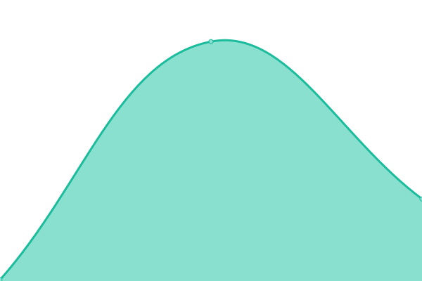
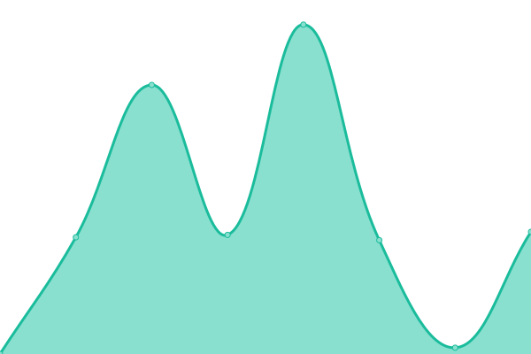

# [📈 Live Status](https://luxhaven360.github.io/upptime): <!--live status--> **🟧 Partial outage**

This repository contains the open-source uptime monitor and status page for [Mdrean](https://luxhaven360.github.io/upptime), powered by [Upptime](https://github.com/upptime/upptime).

With [Upptime](https://upptime.js.org), you can get your own unlimited and free uptime monitor and status page, powered entirely by a GitHub repository. We use [Issues](https://github.com/luxhaven360/upptime/issues) as incident reports, [Actions](https://github.com/luxhaven360/upptime/actions) as uptime monitors, and [Pages](https://luxhaven360.github.io/upptime) for the status page.

<!--start: status pages-->
<!-- This summary is generated by Upptime (https://github.com/upptime/upptime) -->
<!-- Do not edit this manually, your changes will be overwritten -->
<!-- prettier-ignore -->
| URL | Status | History | Response Time | Uptime |
| --- | ------ | ------- | ------------- | ------ |
|  [Sito Principale](https://luxhaven360.com) | 🟩 Up | [sito-principale.yml](https://github.com/luxhaven360/upptime/commits/HEAD/history/sito-principale.yml) | 

 233ms
     
 | 

<a href="https://luxhaven360.github.io/upptime/history/sito-principale">100.00%</a>
    

|  [The Project](https://luxhaven360.com/the-project/) | 🟩 Up | [the-project.yml](https://github.com/luxhaven360/upptime/commits/HEAD/history/the-project.yml) | 

 143ms
     
 | 

<a href="https://luxhaven360.github.io/upptime/history/the-project">100.00%</a>
    

|  [Sistema Prenotazioni](https://luxhaven360.com/product-details/) | 🟥 Down | [sistema-prenotazioni.yml](https://github.com/luxhaven360/upptime/commits/HEAD/history/sistema-prenotazioni.yml) | 

 57ms
     
 | 

<a href="https://luxhaven360.github.io/upptime/history/sistema-prenotazioni">0.00%</a>
    

|  [Portale Reports](https://reports.luxhaven360.com) | 🟩 Up | [portale-reports.yml](https://github.com/luxhaven360/upptime/commits/HEAD/history/portale-reports.yml) | 

 253ms
     
 | 

<a href="https://luxhaven360.github.io/upptime/history/portale-reports">100.00%</a>
    

|  [API Core](https://script.google.com/macros/s/AKfycbwr79RkXIEocpuOKaM6uMJqE6VFs9wjlUPvrr__FvDbDDrD2ELB1NbfrWP3BCYpHj2u/exec?action=ping) | 🟩 Up | [api-core.yml](https://github.com/luxhaven360/upptime/commits/HEAD/history/api-core.yml) | 

 1817ms
     
 | 

<a href="https://luxhaven360.github.io/upptime/history/api-core">100.00%</a>
    

|  [Servizi Community](https://script.google.com/macros/s/AKfycbwrDLCy9xO2mcX0ORieD5k9Ck7_6ysrnBfayWg_Gd_Pno4UrCa-2JuBTvkzBNvkfQ_xxQ/exec) | 🟩 Up | [servizi-community.yml](https://github.com/luxhaven360/upptime/commits/HEAD/history/servizi-community.yml) | 

 1849ms
     
 | 

<a href="https://luxhaven360.github.io/upptime/history/servizi-community">100.00%</a>
    

|  [Sistema Abbonamenti](https://script.google.com/macros/s/AKfycbyLb-E_43gf3inu4cC062Cn-OpbXK1fM8QiflQ8k6F_uxRrorcTVhWVUOgOWTJrOFwa/exec?action=ping) | 🟩 Up | [sistema-abbonamenti.yml](https://github.com/luxhaven360/upptime/commits/HEAD/history/sistema-abbonamenti.yml) | 

 1671ms
     
 | 

<a href="https://luxhaven360.github.io/upptime/history/sistema-abbonamenti">100.00%</a>
    

|  [Protezione Accessi](https://script.google.com/macros/s/AKfycbyLT41A8PPuQwyjCHkFA6anJhp-ywVJhy7TlMpxydaw3osPuplcsfafiNANA3s1hzk7/exec?action=health) | 🟩 Up | [protezione-accessi.yml](https://github.com/luxhaven360/upptime/commits/HEAD/history/protezione-accessi.yml) | 

 1484ms
     
 | 

<a href="https://luxhaven360.github.io/upptime/history/protezione-accessi">100.00%</a>
    

|  [CDN Assets](https://cdn.luxhaven360.com) | 🟩 Up | [cdn-assets.yml](https://github.com/luxhaven360/upptime/commits/HEAD/history/cdn-assets.yml) | 

 903ms
     
 | 

<a href="https://luxhaven360.github.io/upptime/history/cdn-assets">100.00%</a>
    

|  [Reports API](https://reports-api.luxhaven360.com/health) | 🟩 Up | [reports-api.yml](https://github.com/luxhaven360/upptime/commits/HEAD/history/reports-api.yml) | 

 204ms
     
 | 

<a href="https://luxhaven360.github.io/upptime/history/reports-api">8.83%</a>
    

|  [Database](https://tilxhlrwhqvmpxugvslw.supabase.co) | 🟥 Down | [database.yml](https://github.com/luxhaven360/upptime/commits/HEAD/history/database.yml) | 

 48ms
     
 | 

<a href="https://luxhaven360.github.io/upptime/history/database">0.00%</a>
    

|  [API Cambio Valuta](https://api.frankfurter.app/latest) | 🟩 Up | [api-cambio-valuta.yml](https://github.com/luxhaven360/upptime/commits/HEAD/history/api-cambio-valuta.yml) | 

 19629ms
     
 | 

<a href="https://luxhaven360.github.io/upptime/history/api-cambio-valuta">100.00%</a>
    

|  [Pagamenti Stripe](https://checkout.stripe.com) | 🟩 Up | [pagamenti-stripe.yml](https://github.com/luxhaven360/upptime/commits/HEAD/history/pagamenti-stripe.yml) | 

 508ms
     
 | 

<a href="https://luxhaven360.github.io/upptime/history/pagamenti-stripe">100.00%</a>
    

|  [Geolocalizzazione](https://ipapi.co/json/) | 🟩 Up | [geolocalizzazione.yml](https://github.com/luxhaven360/upptime/commits/HEAD/history/geolocalizzazione.yml) | 

 149ms
     
 | 

<a href="https://luxhaven360.github.io/upptime/history/geolocalizzazione">100.00%</a>
    

<!--end: status pages-->

[**Visit our status website →**](https://luxhaven360.github.io/upptime)

## 📄 License

- Powered by: [Upptime](https://github.com/upptime/upptime)
- Code: [MIT](./LICENSE) © [Anand Chowdhary](https://anandchowdhary.com), supported by [Pabio](https://pabio.com)
- Data in the `./history` directory: [Open Database License](https://opendatacommons.org/licenses/odbl/1-0/)
